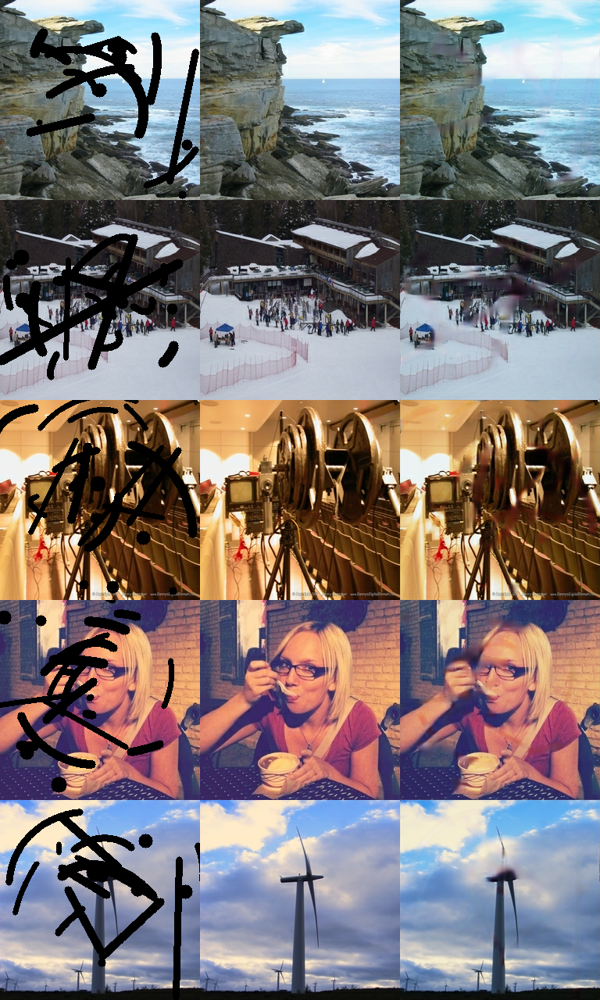
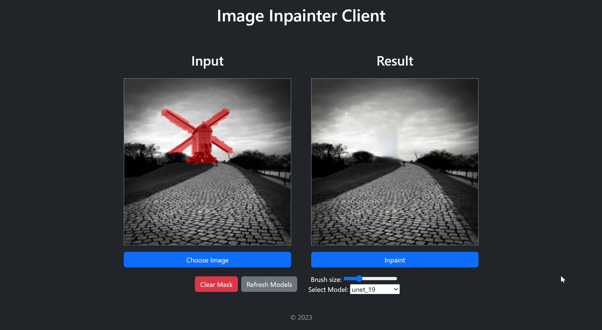

# CV Image Inpainting

Deep learning project for filling in holes in images.

## Report

Report about the project can be found on wandb here: https://wandb.ai/put_dl_team/cv3B-ii-ae-unet/reports/CV-Image-Inpainting--VmlldzozNDE2MzU5?accessToken=zno34u5pjhz2aolk5ngmqekh7h5yo4rlbzohlkoj3can1oua97cuiviz02zfba92

## Application

Application constists of the backend containing predictive models and frontend for easy interation with the models.

To run the application run the following command in the command prompt in the project directory (Docker is needed for this to work).

> docker-compose up

It will open the:

- Frontend app on 127.0.0.1:3000
- Backend app on 127.0.0.1:5000
